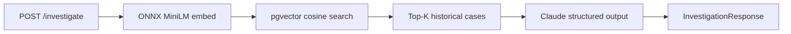

# AI Fraud Intelligence Engine

Spring Boot advisory fraud-intelligence API that combines **local ONNX embeddings**, **pgvector semantic search**, and **Claude** to assess transaction risk. The engine is an **Advisory Oracle** — it returns structured risk guidance (`LOW_RISK`, `HIGH_RISK`, `MANUAL_REVIEW`) and never blocks or authorizes transactions on its own.

## How it works



1. A transaction payload is embedded locally with **all-MiniLM-L6-v2** (384 dimensions).
2. **pgvector** retrieves the most similar historical fraud cases from Supabase.
3. **Claude** (via Spring AI) analyzes the transaction against that context and returns a guardrailed JSON decision.
4. On missing data, low confidence, or infrastructure failure, the **Sad Path** safely defaults to `MANUAL_REVIEW`.

## Tech stack

| Layer | Technology |
|-------|------------|
| Runtime | Java 21, Spring Boot 3.3 |
| LLM | Spring AI + Anthropic Claude (`claude-sonnet-4-6`) |
| Embeddings | Spring AI Transformers + ONNX MiniLM-L6-v2 |
| Vector store | PostgreSQL + pgvector (Supabase) |
| Resilience | Resilience4j circuit breaker + retry |
| API docs | SpringDoc OpenAPI |

## Prerequisites

- **JDK 21**
- **Maven** (or use the included `./mvnw` wrapper)
- **Anthropic API key**
- **Supabase** project with the `pgvector` extension enabled
- **PowerShell** (for the ONNX download script on Windows)

## Getting started

### 1. Clone and download the ONNX model

The tokenizer is committed; model weights (~90 MB) are not.

```powershell
git clone <repository-url>
cd fraud-engine
.\scripts\download-onnx-model.ps1
```

See [`src/main/resources/onnx/all-MiniLM-L6-v2/README.md`](src/main/resources/onnx/all-MiniLM-L6-v2/README.md) for model details.

### 2. Configure environment variables

| Variable | Required | Description |
|----------|----------|-------------|
| `ANTHROPIC_API_KEY` | Yes | Anthropic API key for Claude |
| `SUPABASE_DB_PASSWORD` | Yes | Supabase database password |

Update `src/main/resources/application.yaml` with your Supabase **Session pooler** JDBC URL and username (Project Settings → Database → Session pooler). The direct `db.*.supabase.co` host is IPv6-only and may fail on some networks.

### 3. Create the database schema

Run in the Supabase SQL editor:

```sql
CREATE EXTENSION IF NOT EXISTS vector;

CREATE TABLE synthetic_fraud_cases (
    id              BIGSERIAL PRIMARY KEY,
    threat_scenario TEXT NOT NULL,
    advisory_context TEXT NOT NULL,
    risk_level      TEXT NOT NULL,
    embedding       vector(384)
);

CREATE INDEX ON synthetic_fraud_cases
    USING hnsw (embedding vector_cosine_ops);
```

### 4. Seed historical cases (first run)

Enable the seed runner to embed and load synthetic fraud scenarios from `src/main/resources/data/synthetic-fraud-seed.json`:

```yaml
# application.yaml
fraud:
  seed:
    enabled: true
    force: false   # set true to truncate and re-seed
```

Set `enabled: false` again after the initial seed.

### 5. Run the application

```powershell
$env:ANTHROPIC_API_KEY = "your-key"
$env:SUPABASE_DB_PASSWORD = "your-password"
./mvnw spring-boot:run
```

The API starts on **http://localhost:8080**.

## API

### Investigate a transaction

```http
POST /api/v1/fraud/investigate
Content-Type: application/json
```

**Request**

```json
{
  "transactionId": "txn-9f3a2b1c",
  "accountId": "acct-88421",
  "amount": 2499.99,
  "merchantCategoryCode": "4829"
}
```

**Response**

```json
{
  "transactionId": "txn-9f3a2b1c",
  "riskLevel": "MANUAL_REVIEW",
  "advisoryNotes": "Transaction pattern resembles money transfer MCC anomalies in historical context."
}
```

### Risk levels

| Level | Meaning |
|-------|---------|
| `LOW_RISK` | No significant similarity to known threat patterns |
| `HIGH_RISK` | Strong similarity to documented fraud scenarios |
| `MANUAL_REVIEW` | Insufficient data, pipeline failure, or ambiguous signal — human review required |

### OpenAPI / Swagger UI

Interactive docs: **http://localhost:8080/swagger-ui/index.html**

## Fault tolerance

The investigation endpoint is wrapped with Resilience4j **retry** and **circuit breaker**. Failures (LLM timeout, DB errors, etc.) fall back to `MANUAL_REVIEW` rather than failing open or closed.

Missing critical fields (`accountId`, `amount`) also force `MANUAL_REVIEW` before any external call is made.

Every request is traced via SLF4J MDC using `transactionId` when provided, or a generated UUID.

## Project structure

```
src/main/java/com/fraudintel/
├── controller/     REST API (investigation endpoint)
├── service/        RAG query + Claude orchestration
├── repository/     pgvector similarity search
├── config/         Embedding, pgvector, OpenAPI
├── domain/         Request/response records, FraudRiskLevel enum
├── seed/           Synthetic fraud case seeder
└── observability/  MDC trace context

src/main/resources/
├── application.yaml
├── data/synthetic-fraud-seed.json
└── onnx/all-MiniLM-L6-v2/   Local embedding model assets
```

## Testing

Tests use the `test` profile with an in-memory H2 database and a mocked `EmbeddingModel` — no ONNX weights or Supabase connection required.

```powershell
./mvnw test
```

## Configuration reference

Key settings in `application.yaml`:

| Property | Default | Description |
|----------|---------|-------------|
| `spring.ai.anthropic.chat.options.model` | `claude-sonnet-4-6` | Claude model |
| `spring.ai.anthropic.chat.options.temperature` | `0.0` | Deterministic advisory output |
| `fraud.seed.enabled` | `false` | Run vector seed on startup |
| `fraud.seed.force` | `false` | Truncate table before re-seeding |
| `resilience4j.*.llmInvestigate` | — | Retry/circuit breaker for the investigate pipeline |

## License

Add a license file before publishing. ONNX model weights are subject to upstream terms — see the [MiniLM model card](https://huggingface.co/sentence-transformers/all-MiniLM-L6-v2).
